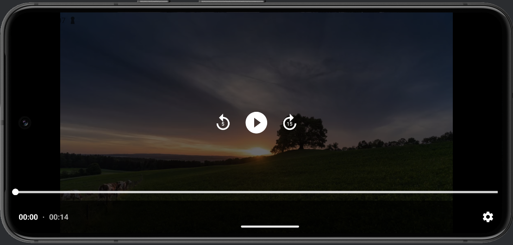
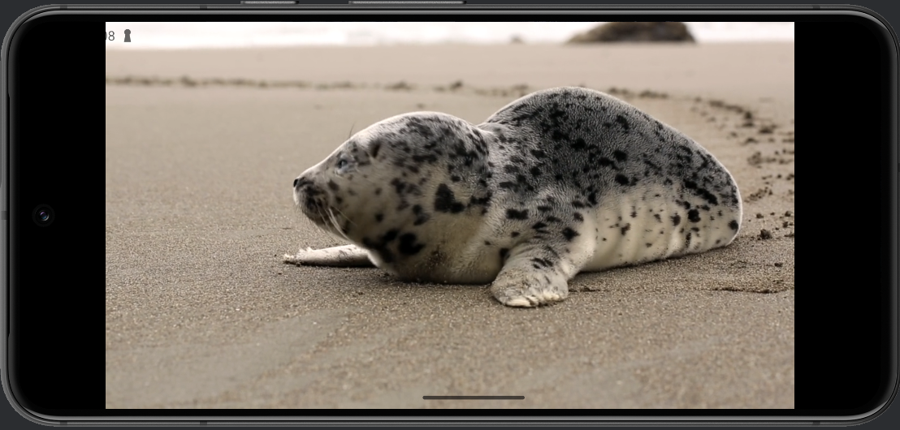
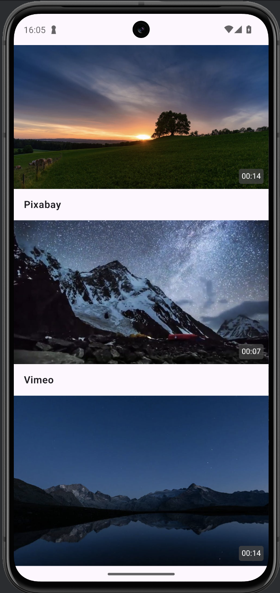

# VkTest

## Описание
VkTest – это Android-приложение для просмотра списка видео и их воспроизведения. Реализован список видео с загрузкой из удаленного API, а также возможность воспроизведения видео с использованием ExoPlayer.

## Функциональность
### Экран со списком видео
- Отображение списка видео на главном экране с подгрузкой и кешированием.
- Для каждого видео отображается миниатюра (thumbnail), имя автора и продолжительность.
- Данные загружаются из API Pexels (https://www.pexels.com/api/).
- Поддержка обновления списка видео с помощью PullToRefreshBox.

### Экран просмотра видео
- При нажатии на видео открывается экран просмотра.
- Воспроизведение видео с использованием ExoPlayer.
- Управление воспроизведением (пауза, воспроизведение, перемотка).
- Поддержка поворота экрана для полноэкранного режима.

## Архитектура и технологии
- **Архитектурный подход**: MVI (MVIKotlin).
- **Работа с сетью**: Retrofit.
- **Управление зависимостями**: Dagger.
- **Минимальная версия Android**: 8.0 (API 26).

## Дополнительные возможности
- Кеширование списка видео с помощью Room.
- Обработка ошибок (например, отсутствие интернета, ошибки загрузки данных).
- Корректная работа в портретном и ландшафтном режимах.

## Запуск проекта
1. Клонируйте репозиторий:
   ```sh
   git clone https://github.com/1beattrue/VkTest
   ```
2. Откройте проект в Android Studio.
3. В файл ```gradle.properties``` добавьте Api Key в следующем формате: ```apikey=API_KEY```
4. Соберите и запустите приложение на эмуляторе или физическом устройстве.

## Скриншоты
<div style="display: flex; gap: 10px; align-items: center;">
   <div style="display: flex; flex-direction: column; gap: 10px;">
    
    
  </div>
  
</div>


